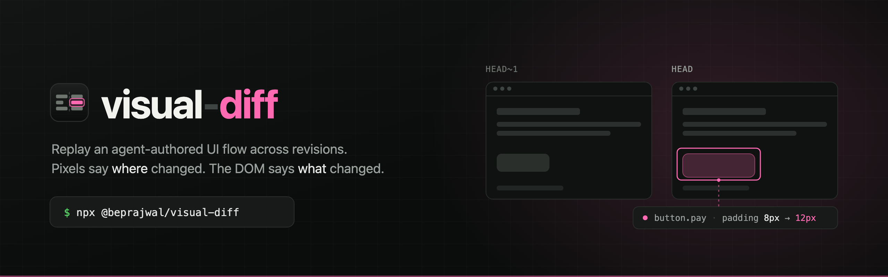

<p align="center">
  
</p>

<h1 align="center">visual-diff</h1>

<p align="center">
  <a href="https://www.npmjs.com/package/@beprajwal/visual-diff"></a>
  <a href="https://github.com/beprajwal/visual-diff/actions/workflows/ci.yml"></a>
  <a href="#on-a-pull-request"></a>
  <a href="#quickstart-no-install"></a>
  <a href="LICENSE"></a>
</p>

Replay an agent-authored UI workflow against one or more revisions of a frontend, capture full
evidence per step, compute annotated visual and semantic diffs between any two runs, and review
them in a live local report where a human leaves feedback the agent reads back.

The package is `@beprajwal/visual-diff`; the binary is `vdiff`.

- **Pixels say *where* changed, the DOM says *what* changed.** A pixel diff finds changed regions,
  each region is hit-tested against a DOM snapshot to name the responsible element, and those
  elements are tree-diffed for the specific property change.
- **Flows are declarative YAML with a closed step vocabulary**, so two versions of a workflow can be
  compared structurally without executing either one.
- **Runs are append-only and git-anchored**, so any two runs are comparable and a missing point is
  offered as a backfill rather than an error.
- **The report never executes anything.** It appends structured JSON feedback to a file; an agent
  decides what to do with it.

## Quickstart (no install)

Everything runs through `npx`. Nothing is installed into your project, and nothing is downloaded
until you ask for it — the package depends on `playwright-core`, so `npx @beprajwal/visual-diff --help`
costs one small download rather than a browser bundle.

```sh
cd your-project

npx @beprajwal/visual-diff install claude-code   # write the visual-diff skill + /vdiff commands into .claude/
npx @beprajwal/visual-diff init                  # scaffold .visual-diff/config.yaml, gitignore rules, a flow
npx @beprajwal/visual-diff install-browser       # one-time Chromium download (the only network step)

# edit .visual-diff/config.yaml (your dev command) and .visual-diff/flows/example.yaml
npx @beprajwal/visual-diff run example           # replay the flow against the working tree
npx @beprajwal/visual-diff run example --at HEAD~1
npx @beprajwal/visual-diff diff example          # findings for the last two runs
npx @beprajwal/visual-diff serve --open          # live local report; hand the URL to a human
```

`install <target>` takes `--dir <path>` to target another directory, `--force` to overwrite files
it wrote before that you have since edited, and `--dry-run` to print what it would write. The agent
harnesses are `claude-code`, `codex`, `opencode` and `pi`; `github-actions` writes CI workflows
instead of skills (see [On a pull request](#on-a-pull-request)). An unrecognised target exits 2 and
lists what is supported, and `vdiff install --list` prints every target with the exact files it would
write.

Requires Node 20 or newer.

## Install it properly

If you would rather not go through `npx` every time, install it globally. That puts `vdiff` on your
`PATH`, so every command in this README works exactly as written, with no prefix.

```sh
npm install -g @beprajwal/visual-diff

vdiff install claude-code
vdiff install-browser     # one-time Chromium download
vdiff init                # scaffold .visual-diff/config.yaml, gitignore rules, example flow
```

To pin the version per project instead — so everyone on the team and CI run the same one — add it
as a dev dependency. The binary lands in `node_modules/.bin`, which `npm run` scripts already have
on their `PATH`; from an interactive shell reach it with `npx vdiff`.

```sh
npm install --save-dev @beprajwal/visual-diff
npx vdiff install claude-code
```

## The four core commands

```sh
vdiff run <flow> [--at <ref>]     # replay a flow at the working tree or a historical revision
vdiff diff <flow> [base] [head]   # compute findings for a pair (defaults: N-1 vs N)
vdiff serve [--open]              # live local report: filmstrip, side-by-side, findings, feedback
vdiff feedback [--json] [--ack]   # pull the human comments left in the report
```

Every command accepts `--json` and emits a single envelope object on stdout, which is the
agent-facing API. Exit codes: `0` success, `1` run or replay failure, `2` config or spec error, `3` an
opt-in gate tripped. `vdiff diff` exits `0` even when findings exist — findings are information, not a
gate — and `3` is reachable only from `vdiff comment --fail-on`, which nothing sets by default.

Supporting commands: `vdiff install <target>`, `vdiff init`, `vdiff flow new|check <name>`,
`vdiff runs <flow>`, `vdiff pin|prune <run>`, `vdiff install-browser`.

## On a pull request

```sh
npx @beprajwal/visual-diff install github-actions   # writes .github/workflows/visual-diff{,-baseline}.yml
```

That is the whole setup. The pull-request workflow replays each flow at the merge-base and at the
head, diffs them, uploads the evidence, and leaves one comment per flow that it updates in place on
every push. The check stays **green**: findings are reported, not enforced, until you set
`fail-on: high` or `fail-on: any` in the workflow.

The pipeline itself lives in a composite action (`beprajwal/visual-diff@v<version>`) rather than in
the file you just installed, so a fix reaches you on the next version bump. The installed workflows
are yours — edit them, and a re-install preserves your edits and says so.

```yaml
- uses: beprajwal/visual-diff@v0.5.0
  with:
    flows: checkout search       # default: every flow in .visual-diff/flows
    fail-on: none                # none | high | any
    baseline: auto               # auto | cache | replay
    publish-branch: ''           # set it to embed screenshots in the comment
    cli: ''                      # e.g. `npx vdiff` to use the version pinned in package.json
```

Two commands do the rendering, and both work on their own, in any CI system or none:

```sh
vdiff comment <flow> [base] [head]   # the diff as markdown: stdout, or --out <file>
vdiff export  <flow> [base] [head]   # a bundle: findings.json, comment.md, report.html, images/
```

Neither posts, pushes or uploads anything, and neither takes a token — the CLI renders, the action
transports. Two consequences worth knowing before you read a comment and wonder:

- **Screenshots need a URL.** GitHub cannot render an image out of a workflow artifact, so by default
  the comment carries the tables and links to the artifact. Nominate `publish-branch` and the action
  pushes that pull request's diff images to it, which is what makes them embeddable.
- **The base side is the merge-base**, replayed at that revision with that revision's flow spec — not
  the base branch tip, which would report other people's changes as yours. `visual-diff-baseline.yml`
  caches runs from your default branch so most pull requests restore the base side instead of
  replaying it; delete that workflow and every pull request replays, which is slower and identical.

The design is in
[`docs/superpowers/specs/2026-08-11-ci-mode-design.md`](docs/superpowers/specs/2026-08-11-ci-mode-design.md),
including what CI mode deliberately still does not do: there is no hosted report and no
baseline-approval workflow.

## A flow spec

```yaml
version: 1
flow: checkout
baseUrl: http://localhost:5173
viewports: [1280x800, 390x844]
network: { mode: replay, har: checkout.har }
steps:
  - id: cart
    goto: /cart
    waitFor: "[data-test=cart-list]"
    mask: ["[data-test=order-date]"]
  - id: pay-form
    click: "[data-test=pay]"
    waitFor: "text=Payment"
```

Step `id`s are stable and load-bearing: diffs align runs by `id`, never by index. `.visual-diff/flows/`
and `.visual-diff/config.yaml` must be committed; runs, diffs, cache and feedback are ignored.

## Development

```sh
npm install
npm run test        # everything
npm run test:unit   # colocated unit + golden tests, no browser
npm run typecheck
npm run build       # clean dist + tsc emit + report UI bundle + skills + executable bin
```

`build` empties `dist/` first. `tsc` only ever adds to its `outDir`, so without that step the
compiled remains of a deleted module stay on disk and ship to every consumer — the published tree
has to stay a function of the source tree.

The runtime dependency is `playwright-core`; `playwright` is a devDependency only, because the
published package must not make an `npx` user download browsers before the CLI can print its help.
`vdiff install-browser` fetches Chromium on demand, and the two packages share one browser
registry, so a browser installed either way is found by both.

`jpeg-js` is there for one reason: a Playwright trace stores its screenshots as JPEG, and every
other layer of this tool reads a shot as `screenshot.png` — the store names the file, the diff
engine decodes it with `pngjs`, the report serves it. `vdiff e2e` converts each frame once at
ingest (`src/e2e/image.ts`), which needs a JPEG decoder; Node ships none and `pngjs` only encodes
PNG. It is pure JavaScript with no dependencies of its own and no install script, so it does not
reintroduce the postinstall `playwright` was dropped for.

The skills live in `skills/` as plain markdown — `manifest.json` naming the ids, one
`<id>/SKILL.md` each. `npm run build:skills` copies that tree to `dist/skills/` so it ships with the
CLI, and fails the build if the manifest names a skill that is not on disk. A harness plugin is only
an envelope around this markdown, which is why the markdown is what the package carries.

The composite action is `action.yml` at the repository root. `tests/packaging/action.test.ts` parses
it alongside the workflows the installer writes and asserts they agree — every input a workflow passes
is an input the action declares, and the version it pins is this build's. What a test cannot do is run
a composite action, so `.github/workflows/dogfood-action.yml` does: dispatch it and the packed tarball
runs the whole pipeline against `fixtures/storefront`, capturing a baseline, restoring it from the
cache with the runs directory deleted, diffing a real overlay commit, and checking the bundle it
produced. It is `workflow_dispatch` only, for the same reason the slow-path job is.

The README artwork lives in `assets/`: `logo.svg` is the mark (also good as the repository avatar and
social preview), `cover.svg` is the banner, and `node scripts/render-assets.mjs` rasterises both to
the PNGs the README embeds. The README points at PNGs, not the SVGs, because npm rewrites relative
image paths to raw.githubusercontent.com, which serves SVG as `text/plain` — an SVG banner renders on
GitHub and breaks on the npm page. `assets/` is development-only and is not published.

`npm pack` runs the build (`prepack`) and produces the tarball a consumer actually gets;
`tests/packaging/pack.test.ts` asserts its shape — executable bin with a shebang, `.d.ts` present,
no sourcemaps, the skills present, and no compiled file without a source file behind it.

## Design

The authoritative design document is
[`docs/superpowers/specs/2026-08-08-visual-diff-design.md`](docs/superpowers/specs/2026-08-08-visual-diff-design.md),
with the build breakdown in
[`docs/superpowers/plans/2026-08-08-visual-diff-implementation-plan.md`](docs/superpowers/plans/2026-08-08-visual-diff-implementation-plan.md).
`src/types.ts` is the single shared contract every module codes against.

## License

MIT
