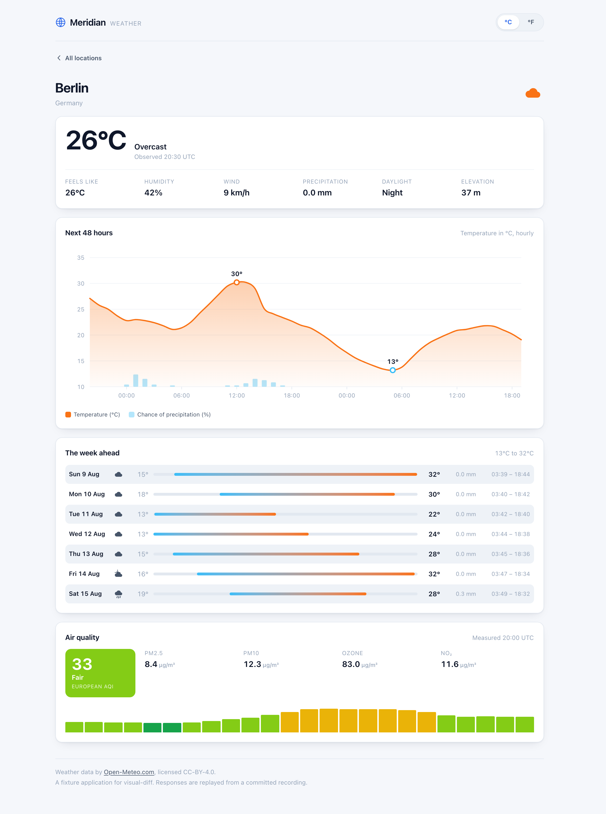
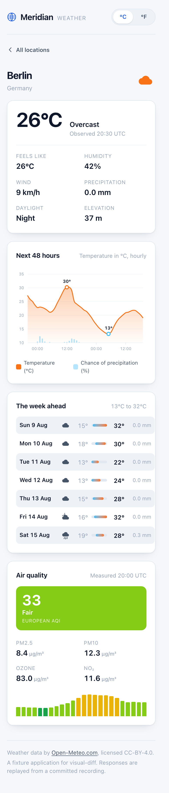
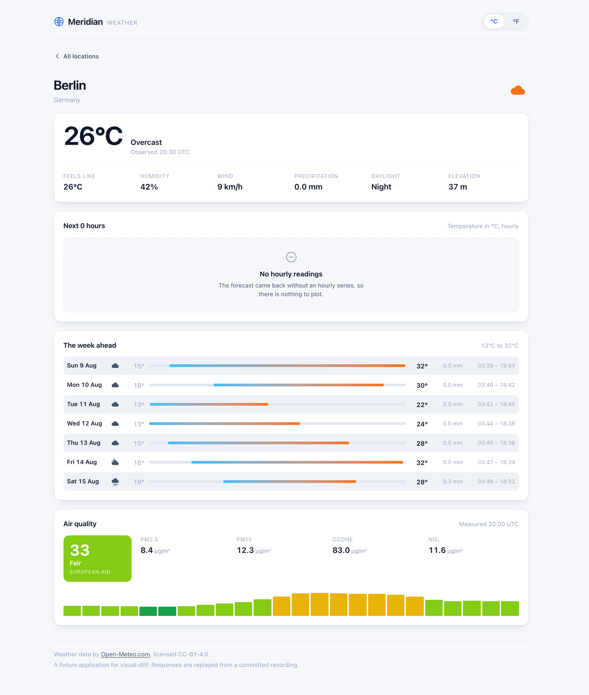
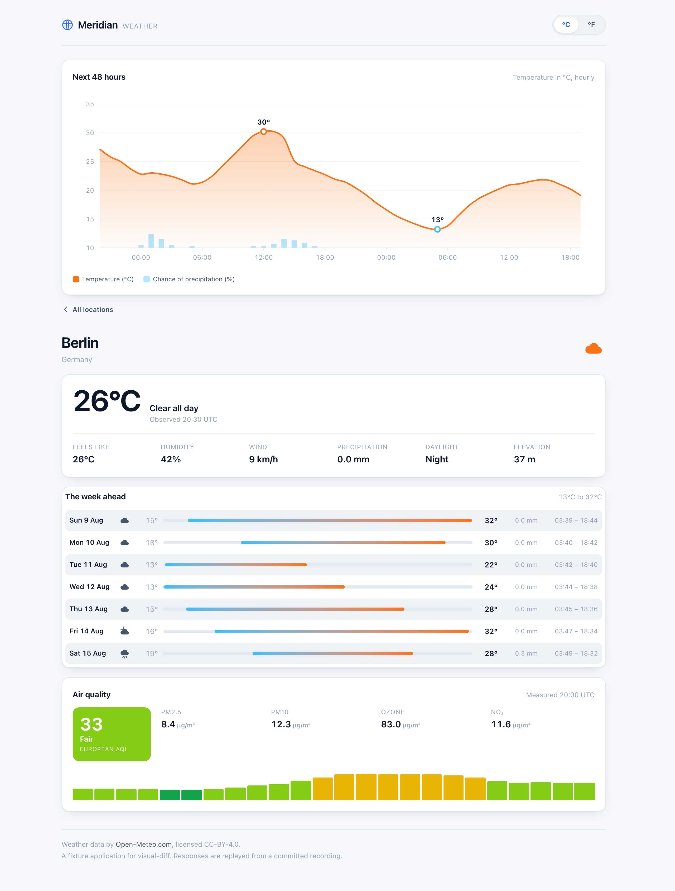
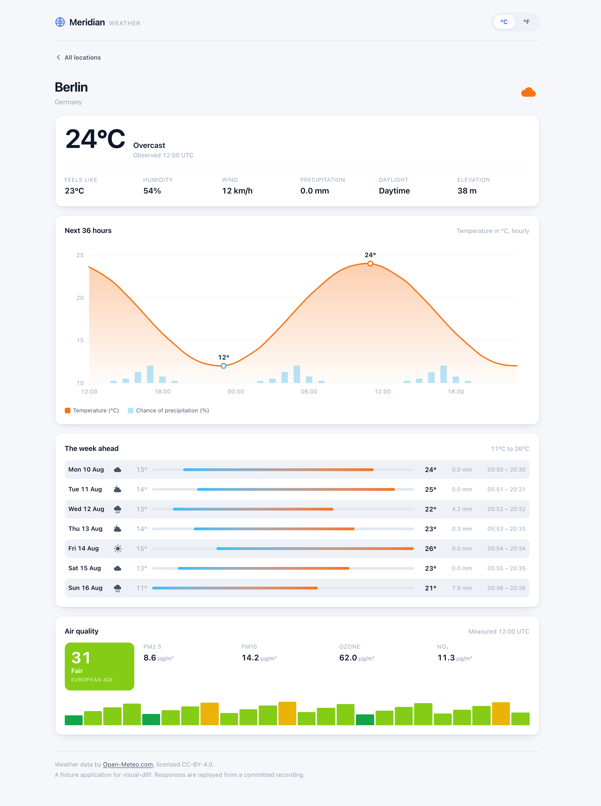
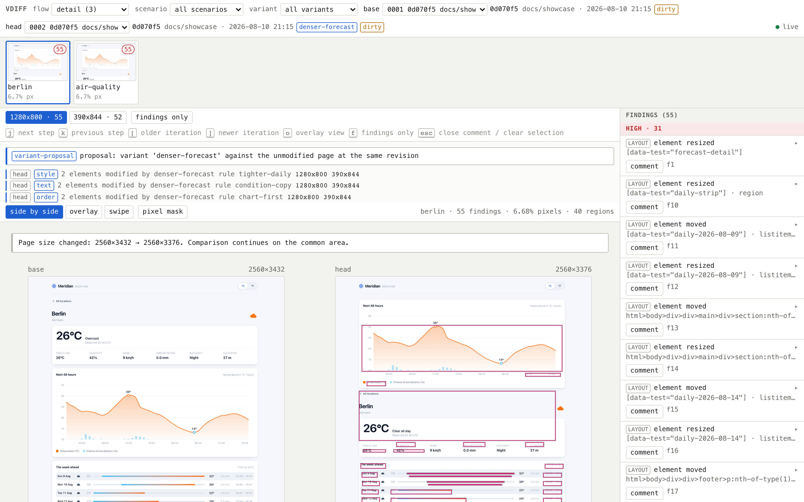

# What visual-diff does, in pictures

Every image here was produced by driving the real CLI against this fixture app — never by hand.
Regenerate the whole set with:

```bash
npm run showcase        # from fixtures/app
```

Because the runner freezes the clock, seeds the RNG, disables animations and gates each capture on a
settle condition, a regenerated screenshot is **byte-identical unless something actually changed**.
So `git status` after a re-run is itself a signal: a modified PNG here means the fixture app, the
capture pipeline, or the report genuinely changed.

The fixture is "Meridian", a small weather dashboard over recorded [Open-Meteo](https://open-meteo.com)
responses. No test ever reaches the network.

---

## 1. The baseline

What the app renders, captured at two viewports. Every other picture on this page is a comparison
against this one.

| desktop | mobile |
|---|---|
|  |  |

Each capture stores more than a screenshot: the DOM with a fixed subset of computed styles, the
accessibility tree, console output and the network log. That is what lets a diff say *which element*
changed and *which property*, rather than just "these pixels differ".

---

## 2. A scenario — states the backend will not give you on demand



Same code, same revision, same commit. The only difference is the API response, patched by a
declarative overlay on the recorded traffic:

```yaml
# .visual-diff/scenarios/empty-forecast.yaml
rules:
  - id: forecast-empty
    match: { method: GET, url: "**/v1/forecast**" }
    patch: { hourly: { temperature_2m: [] } }
```

The chart's empty state is now reachable and, more importantly, **capturable on every revision** —
so "did the empty state break?" becomes a question with an answer.

Note what did *not* change: the current temperature still reads 26°C, because it comes from the real
recording. A scenario is an explicit delta from reality, not a hand-written fixture that drifts away
from what the backend actually returns.

---

## 3. A variant — a proposal, rendered without being built



A variant applies declarative rules to the rendered page just before capture:

```yaml
# .visual-diff/variants/denser-forecast.yaml
rules:
  - id: tighter-daily
    match: "[data-test=daily-strip]"
    style: { gap: 4px, padding: 6px }
  - id: condition-copy
    match: "[data-test=current-condition]"
    text: "Clear all day"
  - id: chart-first
    match: "[data-test=temperature-chart]"
    order: first
```

The chart is now above the conditions card, the copy is restated, the daily strip is denser — with
no code changed and nothing committed. A variant **cannot invent UI**: every rule operates on nodes
the app already rendered, and there is no HTML injection verb. It shows you a rearrangement of what
exists, which is what makes it a prediction rather than a mockup.

---

## 4. Mock mode — a screen with no recording behind it



For UI built ahead of its API, a scenario in `mode: mock` answers every request itself; anything it
does not answer is aborted and reported, never quietly sent to the network. Runs captured this way
are badged, because comparing an invented response against a recorded one is comparing a fiction to
a measurement.

---

## 5. The report


The filmstrip across the top is the workflow, one thumbnail per step with a change count. Below it,
the selected step's before and after, with changed regions boxed. On the right, findings ordered by
severity — `LAYOUT`, `A11Y`, `CONTENT`, `STYLE`, `CONSOLE`, `NETWORK`.

Three things worth noticing:

- **The banner names the comparison.** `variant-proposal: against the unmodified page at the same
  revision`. Comparing a variant to a *different revision* would say so instead, because that mixes
  the proposal with the code change between them.
- **Findings are attributed to rules** — "2 elements modified by `denser-forecast` rule
  `tighter-daily`" — so a change traces back to the line that caused it.
- **The page executes nothing.** It reads the run store and appends comments to a file; an agent
  decides what to do with them. No endpoint spawns a process or touches git.

The same pair in overlay mode, which is what makes a small shift obvious:



`cli-output.txt` in this directory holds the terminal summaries for both comparisons.

---

## What the tool refuses to do quietly

Most of the design effort went into failure modes that *look* like success. A screenshot that seems
right but isn't is worse than an error, so each of these is a loud warning rather than a silent
pass:

| situation | what it says |
|---|---|
| a scenario rule matched nothing | "those requests were served from the recording unchanged, so the screens you are looking at are the recorded state, not the patched one" |
| a variant rule was reverted by a re-render | names the rule, because the screenshot would otherwise be the unvaried UI labelled as a proposal |
| a request had no recorded response | aborted and counted as a HAR miss — never silently fetched live |
| the settle gate timed out | records the outstanding requests instead of screenshotting a half-rendered frame |
| git state moved mid-run | the run is flagged `unstable` and suggests a re-run |

The first two were both triggered by mistakes made while producing this very page — a variant
authored against selectors from another route, and screenshots copied between runs that changed the
working tree's identity mid-capture. The tool caught both.
